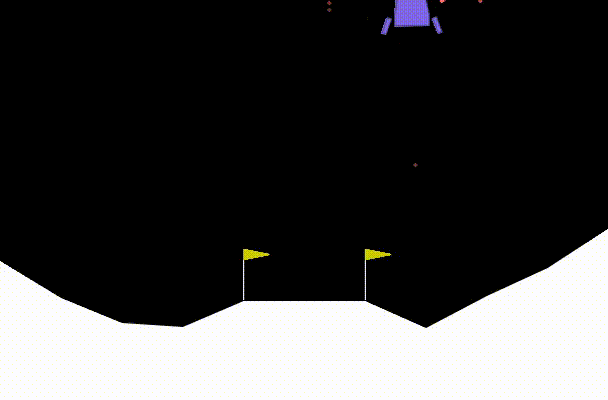
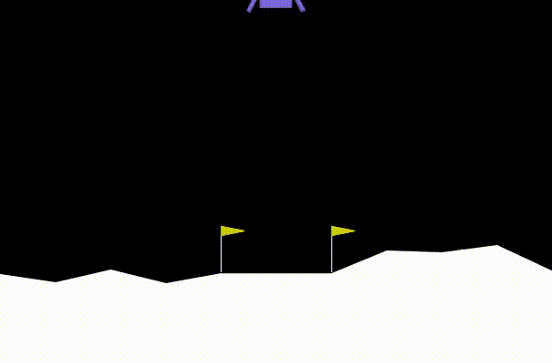
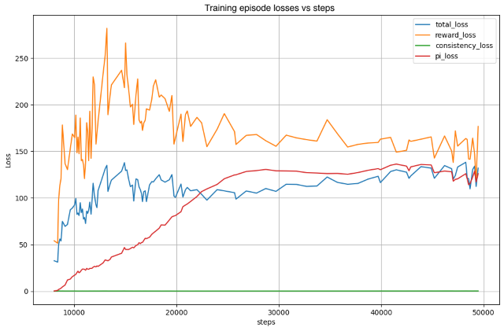
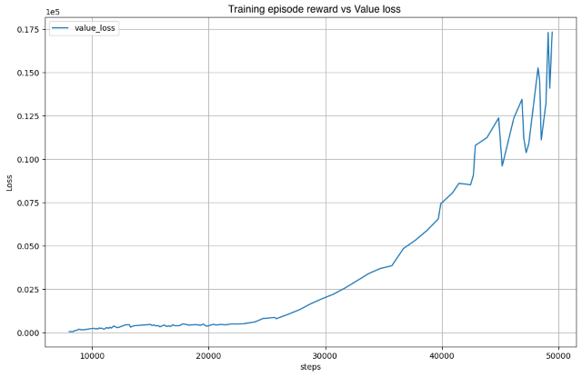
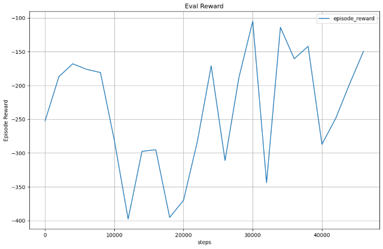
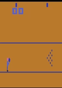
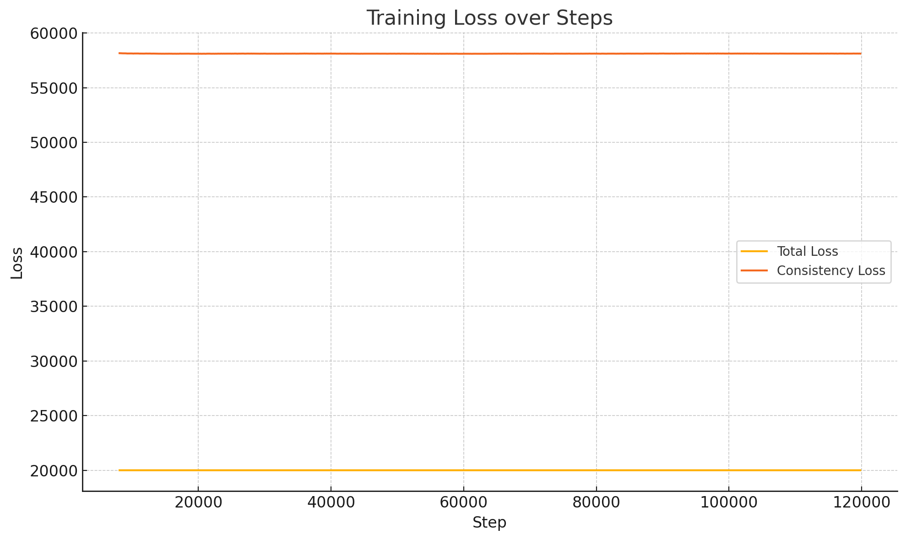

# Evaluating Model Based Deep RL on Continuous and Discrete Action spaces

## Abstract
It is believed that Traditional TD based approach for RL suffers from sample ineffiency. To solve this issue, it is theoretically believed that the model based approach of 'planning' the action sequences (trajectories) and get the approximate reward by forward simulating (or dreaming) can solve this problem. In this project, we attempt to see how the model based approach performs for continuos and discrete action spaces. 

We evaluate two strategies:  
1. Pre-Trained World and Reward model with Randomized Action Planning
2. TD-MPC approach. 

We implemented the two strategies on two different environments.
1. Control systems environment for continuous action space.
2. Atari games environment for discrete action space.

TD-MPC approach is defined for continuous action spaces and we implemented a mean-field approximation [3] to convert from a continuous Gaussian distribution to a Softmax distribution and present the results for two discrete environments.

## Methods explored

### Pretrained Model with Random Shooting
In this approach, we try to train two models needed for simulation (or dreaming), namely the world model and reward model.
- World Model : Predicts the next observation based on current observation and action performed.

- Reward Model : Predicts the reward to be obtained if we perform given action on current observation.

Both World and Reward model are simple CNNs for atari and MLP for control environments, which map from observation space to observation space and observation space to reward respectively.

The collection of dataset to train these model is done by interacting with gym enivronment using random sampling of actions. We make the dataset by collecting the $(o_t, a_t, r_t, o_{t+1})$
where:
- $o_t$ : current observation
- $a_t$ : action performed
- $r_t$ : reward from gym env
- $o_{t+1}$ : next observation

The inference methodology is the following:
1. Create trajectories (multiple action sequences) with certain horizon.

2. Evaluate the trajectories by accumulating rewards using simulation via world and reward model.

3. We argmin or argmax the reward to get the best action sequence and choose the first action as the best action.

4. Perform the best action on environment and repeat from step1, using next observation.

Training of Pretrained Models

Inferencing using simulation using random action sampling.

For training pretrained models for atari games has some changes for world model (reward model remains same) is done using auto-encoding approach.

1. Encoder
A CNN that takes in a 4-frame stacked Atari observation (shape: 4×84×84) and Outputs a latent vector: $z_t = encoder(state_t)$

2. Action Conditioning
Convert action (e.g. 0–5 in Pong) to a one-hot vector
Concatenate with the latent state $z_t$

3. Transition Model
A feedforward MLP that takes $z_t$ and action, and outputs a prediction $ẑ_{t+1}$ of the next latent

4. Decoder
A CNN that takes $ẑ_{t+1}$ and reconstructs $state_{t+1}$ (i.e., the next frame stack)

5. Computing Loss
Compute loss between $statê_{t+1}$ and actual $state_{t+1}$ using Mean squared error loss.

### TD-MPC approach
<!-- 
Layout: 
[x] approach overview
[x] loss function equations
[] implementation peculiarities
-->
In this approach we reimplement Temporal Difference Model Predictive Control (TDMPC) [1] which uses Model Predictive Path Control [2] for planning and Temporal Difference 0 (TD0) to train the model. Unlike the method mentioned above the main advantage claimed by TDMPC is to learn embeddings from high dimensional pixel space without learning unnecessary details like shading.

The model consists of
- Q-value function estimate $Q_\theta(a_t, s_t)$.
- Embedding network $h_\theta(s_t) \to z_t$ which converts the high dimensional input state $s_t \in \mathcal{S}$ to the latent vector representation $z_t \in \mathbb{R}^{l}$ where $l$ is the latent dimension.
- Dynamics network $d_{\theta}(z_t, a_t)$ which predicts the next latent state vector $z_{t+1}$ given the previous state vector $z_t$.
- Reward model $R_{\theta}(z_t, a_t)$ which approximates the reward model of environment.
- Stochastic policy network $\pi_{\theta}(z_t)$ which predicts a Gaussian distribution over the action space $\mathcal{A}$.

#### Planning
TD-MPC uses augmented version of Model Predictive Path Integral (MPPI) [2]. In this planning procedure the action distribution over horizon of future moves is assumed to be a spherical Gaussian distribution with the policy network as a prior. The parameters ($\mu, \sigma$) are updated iteratively using an importance sampling of the top-k sampled trajectories which maximize the approximate $Q$-value. This equation is given as 

$$ \phi_\Gamma \triangleq \mathbb{E}\left[\gamma^H Q_\theta(z_{H}, a_{H}) + \sum_{t=0}^{H-1} \gamma^t R_\theta(z_t, a_t)\right] $$ 

where, 
$a_t \sim \mathcal{N}(\mu_t^{j-1}, (\sigma_t^{j-1})^2I)$ 

In a loop start with $N$ trajectories of horizon $H$ from $\mathcal{N}(\mu^{j-1}, (\sigma^{j-1})^2I)$ and $N_\pi$ trajectories for horizon $H$ from $\pi_\theta$ and $d_\theta$. Compute $\phi_\Gamma$ for the recorded $N+N_\pi$ trajectories, and get the top-$k$ trajectories notated here as $\Gamma^\star$. Compute $\mu^j, \sigma^j$ for the next iteration as

$$
    \mu^j = \frac{\sum_{i=1}^k e^{\tau(\phi_{\Gamma^\star,i})} \Gamma_i^\star}{\sum_{i=1}^k e^{\tau(\phi_{\Gamma^\star, i})}} 
$$

$$
\sigma^j = \sqrt{\max \left(\frac{\sum_{i=1}^k e^{\tau(\phi_{\Gamma^\star,i})} (\Gamma_i^\star - \mu^j)^2}{\sum_{i=1}^k e^{\tau(\phi_{\Gamma^\star, i})}}, \epsilon \right)}
$$

where, $\epsilon$ is offset to prevent distribution collapse, which is linearly reduced over time to encourage exploration; $\tau$ is the temperature parameter used for soft weight update $\theta$ from $\theta^-$.

#### TD Learning of Latent Dynamics
The loss function used to learn the latent dynamics, Q-value function, and policy are given as

$$
    \mathcal{J}(\theta;\Gamma) = \sum_{i=t}^{t+H} \lambda^{i-t} \mathcal{L}(\theta;\Gamma_i)
$$

where, $\lambda$ is a hyper parameter

$$
    \mathcal{L}(\theta;\Gamma) = c_1 L_1 + c_2 L_2 + c_3 L_3 \\
    L_1 = \Vert  R_\theta(z_i, a_i) - r_i \Vert_2^2 \\
    L_2 = \Vert Q_\theta(z_i, a_i) - (r_i + \gamma Q_{\theta^-}(z_{i+1}, \pi_\theta(z_{i+1}))) \Vert_2^2 \\
    L_3 = \Vert d_\theta(z_i) - h_{\theta^-}(s_{i+1}) \Vert_2^2 \\
$$
where, $c_1, c_2, c_3$ are parameters, $L_1$ is the reward loss, $L_2$ is the TD(0) loss, and $L_3$ is the consistency loss. Observe that the latent consistency loss would allow the model to learn only the relevant dynamics without needing to reconstruct the observations.

#### Implementation Details
<!-- 
[x] priority buffer
[x] Predict std in policy network
[x] Mean-field approximation (discrete)
 -->
In addition to the methods described in [1], the actual code is implemented with some tricks which are not mentioned in the paper. One of these is the use of a priority based replay buffer, where a score is computed as the L1 loss between the predicted Q value and the TD0 target Q value. We discuss the importance of using a priority based replay buffer in experiments. 

Our implementation differs from the TDMPC implementation in terms of predicting the standard deviation using the policy network itself instead of using a linear schedule of standard deviation.

To convert the continuous domain action distribution to discrete, we use mean-field approximation to compute the mapping from the Gaussian distribution used in planning to a Softmax distribution. In particular we use the **Mean-Field0 (mf0)** approximation presented in [3] to achieve this which is given by
$$
    e_k = SOFTMAX_k \frac{\mu}{\sqrt{1 + \lambda_0 \sigma_k^2}} 
$$

$$
    e_k = \texttt{SOFTMAX}_k \left(\frac{\mu}{\sqrt{1 + \lambda_0 \sigma_k^2}} \right)
$$

where, $k$ is the component of the softmax, $e_k$ is the $k^{\text{th}}$ component of the new softmax mapping, $\lambda_0$ is a parameter.

## Experiments

### Experiments with pre-trained model and random Sampling
#### Pendulum

World model loss curves:  

Reward model loss curves:  

Videos on pendulum

From loss curves, we can see that the world and reward model trained really well. Also we can see the random shooting performs good in the pendulum use-case.

#### LunarLander

#### Atari 

Loss curve for training the world and reward models :
 

 
Videos of inference:

   
  

 
Reward curve for the inference:  
 

### Experiments performed using tdmpc   
#### LunarLander - discrete
**Videos of inference**
 

**Loss curves**
 

We see that the reward model trained poorly, we suspect the reason is that dataset creation through random exploration provides very poor baseline and making reward events sparse.
From the video of inference on atari games, we can see that model does not perform well.

#### LunarLander - continuous
- <U>Implementation 1:</U> <B>With a LIFO replay-buffer with TD(0) and planning horizon of 5</B>
     Videos of inference  
    _horizon(5).gif)

    Loss curves  
    _horizon(5)_total.png)
    _horizon(5)_value.png)
    _horizon(5)_reward.png)

    Observations:
    First we trained our TD-MPC model with a FIFO replay buffer with a buffer capacity of 150,000 episodes. If we look a the curve, we see that the performance is quite poor, the training loss are saturated at 15k steps and the eval rewards drop to -600, which is worse than random. 
     If we look closely at the eval video, we can see in the start the lander hovers, but it degrades quickly. Our hypothesis is, since our replay buffer is filled using the states that our model predicts and since they use TD(0) this makes the model very short-sighted and this tight-coupling between the replay buffer and the model, makes the performance good for early steps but it degrades for later steps since our replay buffer is tightly coupled we never get those observations in the buffer, and the model performs poorly for later steps.
     To verify this hypothesis of ours, we tried to train with TD(10) to increase the horizon, as well as we trained with larger seed steps to ensure that we have quality observations in the replay buffer.
    Finally, we also wrote a priority-based replay buffer to encourage the model to train on less confident observations to have better exploration.

- With a LIFO replay-buffer with TD(10) and planning horizon of 1 with 500 seed steps
     Videos of inference  
    _500.gif)

    Loss curves  
    _500_total.png)
    _500_value.png)
    _500_reward.png)
     In this experiment, we changed TD(0) with TD(10) algorithm, keeping the number of seed steps same as before, viz 500. We noticed significantly better performance than TD(0). If we look at the losses, these are significantly lower by a factor of 1000. But we still see the losses are not converging. 
     But we do see that the eval rewards have a better increasing trend here, and it actually achieves >-200 rewards when compared to previous experiment where rewards were lower than -600.
     If we look at the video, we see there is similar trend as the previous experiment. It learns to hover but doesn't learn how to land and get a net positive reward. We suspect that, even though we have made value loss better and more convergent by using a more stringent TD(10) algorithm, but the problem with the replay buffer still persists, and model doesn't get trained on later stages of the episode.

- With a LIFO replay-buffer with TD(10) and planning horizon of 1 with 8000 seed steps
     Videos of inference  
    .gif)

    Loss curves  
    _total.png)
    _value.png)
    _reward.png)
     Now we increased the seed steps from 500 -> 8000. We see faster convergence to greater than -100 average episode reward on evaluation. We also  see more stable trend on all the loss curves, proving that our hypothesis is correct. Exploration of TD-MPC algorithm is tightly coupled with how good the observation space in replay buffer is, basically TD-MPC on it's own is very slow in exploration and depends upon how rich our replay buffer is to begin with. 
      If we look at the eval rewards we start getting consistently >-150 as rewards, the rewards are still negative, as the model is still plagued from less observations with end steps of an episode, and model is stuck in a local minima. If we see the video it is more evident, as model has learnt that its better to hover and get some negative reward that to actually crashing and getting penalized. 
      In order to address this issue, we thought of experimenting with a different implementation of replay buffer, wehre we can have wight sample observations from a episode based on how confident the model is on those observations. Our hope is, once the model is very confident in the observations in the early stages of episode which helps the model to learn a hovering heuristic. The model will start exploring on the tail-end observations where it is not very confident, and we will see better performance.

- With a priority-replay-buffer with TD(0) and planning horizon of 5
     Videos of inference 
     At 38K steps 
     
     At 40k steps
     

    Loss curves  
    
    
    
     We implemented a priority loss which acted similar to count-based exploration of the replay buffer, which is L1 loss Q-value of the model and td(0)_target Q value, and then computes the sample probablity over the observation set of episodes. We expect that the model will get past the local minima of hovering. 
     If we look at the loss curves and reward curves we see, rewards are consistenly better than the previous run, and at around 40k steps, we see it falls, as it tries new observations but there is still a positive trend in the eval data.
     Finally looking at the uploaded gifs, we can see at 38k steps, the model is consistently better at just hovering and accumulating >-200 reward. But at 40k steps, we believe that now priority loss actually starts the model to skew towards the tail-end observations forcing the model to actually try to land, which results in slightly worse rewards but we can see it actually trying to learn how to land efficiently by firing left and right boosters to reduce the elevation. 

- Pendulum - continuous

Video of inference  

Loss curve  

- Atari (with discrete -> continuous modification)

Video of inference:  

Loss curve

## Observation and conclusions

In this project we have performed experiments with two model based RL methods and explore different techniques that improve performance in both continuous and discrete RL domains. 

The pretrained model with random shooting approach performed really well in the pendulum control environment. We found scaling to be simple and fast. However, this method failed when implemented on atari games. This is mainly because the reward model did not generalize well and since the random exploration makes the reward events rare, the dataset distribution is sparse. One more reason is that the atari games if the planning horizon does not cover the reward event then the evaluation of action sequences results in collapse and bad action choices.

We observed that TD-MPC is heavily dependent on the quality of samples in the replay buffer and we saw an improvement with increasing temporal difference in the TD loss from TD(0) to TD(10). 

## References
[1] Nicklas Hansen and Xiaolong Wang and Hao Su, Temporal Difference Learning for Model Predictive Control, 2022. URL [https://arxiv.org/abs/2203.04955](https://arxiv.org/abs/2203.04955) 
[2] Grady Williams and Andrew Aldrich and Evangelos Theodorou, Model Predictive Path Integral Control using Covariance Variable Importance Sampling, 2015. URL [https://arxiv.org/abs/1509.01149](https://arxiv.org/abs/1509.01149)  
[3] Zhiyun Lu and Eugene Ie and Fei Sha, Mean-Field Approximation to Gaussian-Softmax Integral with Application to Uncertainty Estimation, 2021. URL [https://arxiv.org/abs/2006.07584](https://arxiv.org/abs/2006.07584)  