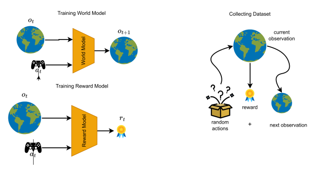
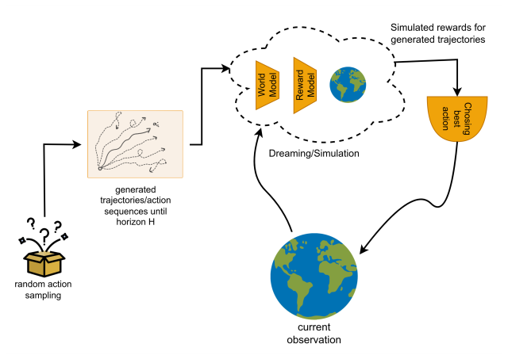
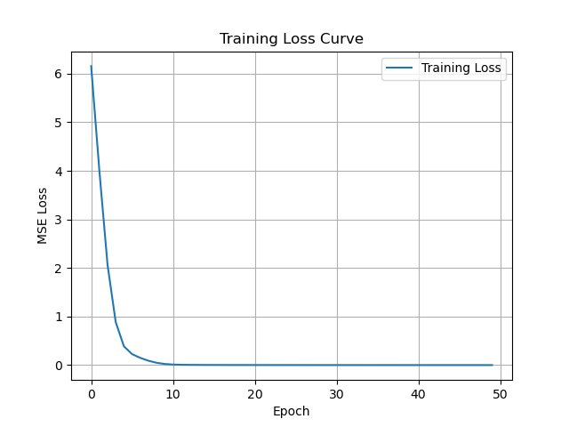
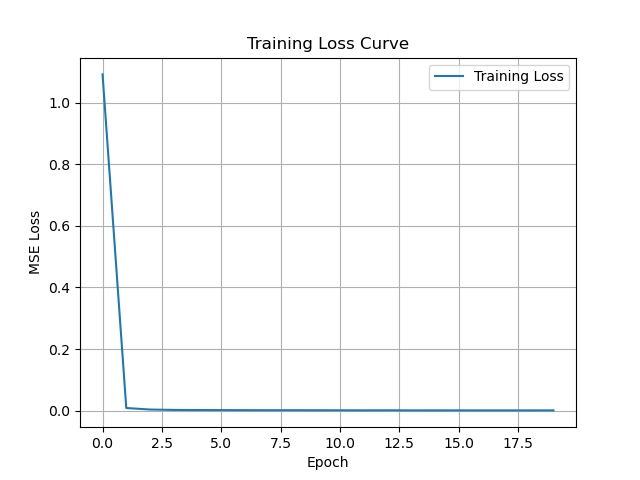
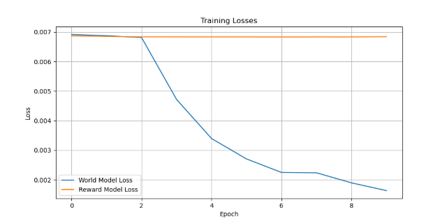
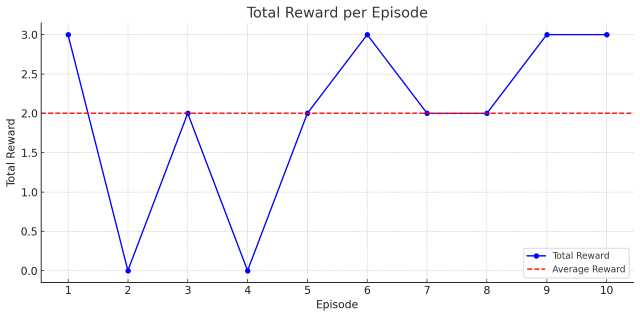
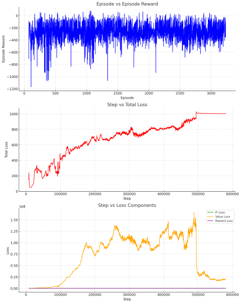
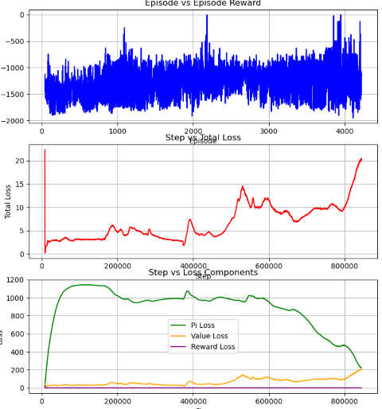

# Evaluating Model Based Deep RL on Continuous and Discrete Action spaces

## Abstract
It is believed that Traditional TD based approach for RL suffers from sample ineffiency. To solve this issue, it is theoretically believed that the model based approach of 'planning' the action sequences (trajectories) and get the approximate reward by forward simulating (or dreaming) can solve this problem. In this project, we attempt to see how the model based approach performs for continuos and discrete action spaces. 

We evaluate two strategies:  
1. Pre-Trained World and Reward model with Randomized Action Planning
2. TD-MPC approach. 

We implemented the two strategies on two different environments.
1. Control systems environment for continuous action space.
2. Atari games environment for discrete action space.

TD-MPC approach is defined for continuous action spaces and we implemented a mean-field approximation [@lu2021meanfieldapproximationgaussiansoftmaxintegral] to convert from a continuous Gaussian distribution to a Softmax distribution and present the results for two discrete environments.

## Methods explored

### Pretrained Model with Random Shooting
In this approach, we try to train two models needed for simulation (or dreaming), namely the world model and reward model.
- World Model : Predicts the next observation based on current observation and action performed.

- Reward Model : Predicts the reward to be obtained if we perform given action on current observation.

Both World and Reward model are simple CNNs for atari and MLP for control environments, which map from observation space to observation space and observation space to reward respectively.

The collection of dataset to train these model is done by interacting with gym enivronment using random sampling of actions. We make the dataset by collecting the $(o_t, a_t, r_t, o_{t+1})$
where:
- $o_t$ : current observation
- $a_t$ : action performed
- $r_t$ : reward from gym env
- $o_{t+1}$ : next observation

The inference methodology is the following:
1. Create trajectories (multiple action sequences) with certain horizon.

2. Evaluate the trajectories by accumulating rewards using simulation via world and reward model.

3. We argmin or argmax the reward to get the best action sequence and choose the first action as the best action.

4. Perform the best action on environment and repeat from step1, using next observation.

Training of Pretrained Models

Inferencing using simulation using random action sampling.

For training pretrained models for atari games has some changes for world model (reward model remains same) is done using auto-encoding approach.

1. Encoder
A CNN that takes in a 4-frame stacked Atari observation (shape: 4×84×84) and Outputs a latent vector: $z_t = encoder(state_t)$

2. Action Conditioning
Convert action (e.g. 0–5 in Pong) to a one-hot vector
Concatenate with the latent state $z_t$

3. Transition Model
A feedforward MLP that takes $z_t$ and action, and outputs a prediction $ẑ_{t+1}$ of the next latent

4. Decoder
A CNN that takes $ẑ_{t+1}$ and reconstructs $state_{t+1}$ (i.e., the next frame stack)

5. Computing Loss
Compute loss between $statê_{t+1}$ and actual $state_{t+1}$ using Mean squared error loss.

### TD-MPC approach
TODO: by subhojeet or eshwar
<!-- 
Layout: 
[x] approach overview
[x] loss function equations
[] implementation peculiarities
-->
In this approach we reimplement Temporal Difference Model Predictive Control (TDMPC) [@hansen2022temporaldifferencelearningmodel] which uses Model Predictive Path Control [@williams2015modelpredictivepathintegral] for planning and Temporal Difference 0 (TD0) to train the model. Unlike the method mentioned above the main advantage claimed by TDMPC is to learn embeddings from high dimensional pixel space without learning unnecessary details like shading.

The model consists of
- Q-value function estimate $Q_\theta(\bm{a}_t, \bm{s}_t)$.
- Embedding network $h_\theta(\bm{s}_t) \to \bm{z}_t$ which converts the high dimensional input state $\bm{s}_t \in \mathcal{S}$ to the latent vector representation $\bm{z}_t \in \mathbb{R}^{l}$ where $l$ is the latent dimension.
- Dynamics network $d_\theta(\bm{z}_t, \bm{a}_t)$ which predicts the next latent state vector $\bm{z}_{t+1}$ given the previous state vector $\bm{z}_t$.
- Reward model $R_\theta(\bm{z}_t, \bm{a}_t)$ which approximates the reward model of environment.
- Stochastic policy network $\pi_\theta(\bm{z}_t)$ which predicts a Gaussian distribution over the action space $\mathcal{A}$.

#### Planning
TD-MPC uses augmented version of Model Predictive Path Integral (MPPI) [@williams2015modelpredictivepathintegral]. In this planning procedure the action distribution over horizon of future moves is assumed to be a spherical Gaussian distribution with the policy network as a prior. The parameters ($\mu, \sigma$) are updated iteratively using an importance sampling of the top-k sampled trajectories which maximize the approximate $Q$-value. This equation is given as 
$$
\begin{align}
    \phi_\Gamma \triangleq \mathbb{E}\left[\gamma^H Q_\theta(\bm{z}_{H}, \bm{a}_{H}) + \sum_{t=0}^{H-1} \gamma^t R_\theta(\bm{z}_t, \bm{a}_t)\right]
\end{align}
$$ 
where, $\bm{a}_t \sim \mathcal{N}(\mu_t^{j-1}, (\sigma_t^{j-1})^2\bm{I})$. In a loop start with $N$ trajectories of horizon $H$ from $\mathcal{N}(\mu^{j-1}, (\sigma^{j-1})^2\bm{I})$ and $N_\pi$ trajectories for horizon $H$ from $\pi_\theta$ and $d_\theta$. Compute $\phi_\Gamma$ for the recorded $N+N_\pi$ trajectories, and get the top-$k$ trajectories notated here as $\Gamma^\star$. Compute $\mu^j, \sigma^j$ for the next iteration as
$$
\begin{align*}
    \mu^j = \frac{\sum_{i=1}^k e^{\tau(\phi_{\Gamma^\star,i})} \Gamma_i^\star}{\sum_{i=1}^k e^{\tau(\phi_{\Gamma^\star, i})}} && \sigma^j = \sqrt{\max \left(\frac{\sum_{i=1}^k e^{\tau(\phi_{\Gamma^\star,i})} (\Gamma_i^\star - \mu^j)^2}{\sum_{i=1}^k e^{\tau(\phi_{\Gamma^\star, i})}}, \epsilon \right)}
\end{align*}
$$
where, $\epsilon$ is offset to prevent distribution collapse, which is linearly reduced over time to encourage exploration; $\tau$ is the temperature parameter used for soft weight update $\theta$ from $\theta^-$.

#### TD Learning of Latent Dynamics
The loss function used to learn the latent dynamics, Q-value function, and policy are given as
$$
\begin{align*}
    \mathcal{J}(\theta;\Gamma) &= \sum_{i=t}^{t+H} \lambda^{i-t} \mathcal{L}(\theta;\Gamma_i)
\end{align*}
$$
where, $\lambda$ is a hyper parameter <!-- TODO: describe this loss function -->
$$
\begin{align*}
    \mathcal{L}(\theta;\Gamma) &= \quad c_1\Vert  R_\theta(\bm{z}_i, \bm{a}_i) - r_i \Vert_2^2 & \text{(reward model loss)}\\
    &\quad + c_2 \Vert Q_\theta(\bm{z}_i, \bm{a}_i) - (r_i + \gamma Q_{\theta^-}(\bm{z}_{i+1}, \pi_\theta(\bm{z}_{i+1}))) \Vert_2^2 & \text{(TD(0) loss)}\\
    &\quad + c_3 \Vert d_\theta(\bm{z}_i) - h_{\theta^-}(\bm{s}_{i+1}) \Vert_2^2 & \text{(latent state consistency loss)}
\end{align*}
$$
Observe that the latent consistency loss would allow the model to learn only the relevant dynamics without needing to reconstruct the observations.

#### Implementation Details
<!-- 
[x] priority buffer
[x] Predict std in policy network
[] Mean-field approximation (discrete)
 -->
In addition to the methods described in [@hansen2022temporaldifferencelearningmodel], the actual code is implemented with some tricks which are not mentioned in the paper. One of these is the use of a priority based replay buffer, where a score is computed as the L1 loss between the predicted Q value and the TD0 target Q value. We discuss the importance of using a priority based replay buffer in experiments. 

Our implementation differs from the TDMPC implementation in terms of predicting the standard deviation using the policy network itself instead of using a linear schedule of standard deviation.

To convert the continuous domain action distribution to discrete, we use a mean-field estimator [@lu2021meanfieldapproximationgaussiansoftmaxintegral]. <!-- TODO: fill mean field estimator from Bishop -->

## Experiments and Videos

Experiments performed using pre-trained model and random sampling

### Pendulum

World model loss curves:  

Reward model loss curves:  

Videos on pendulum

### LunarLander

### Atari 

Loss curve for training the world and reward models :

Videos of inference:  
 

Reward curve for the inference:  

Experiments performed using tdmpc   
- LunarLander - discrete 

Videos of inference  

Loss curves  

- Pendulum - continuous

Video of inference  

Loss curve  

- Atari (with discrete -> continuous modification)

## Observation and conclusions
TODO: (We will do it on wednesday)
- Reward curves
- Possible reasons for failure and performance. 

TODO: (We will do it on wednesday)
What we learnt from the experiments and what couldve been done.

## References
<!-- TODO number the references later -->
